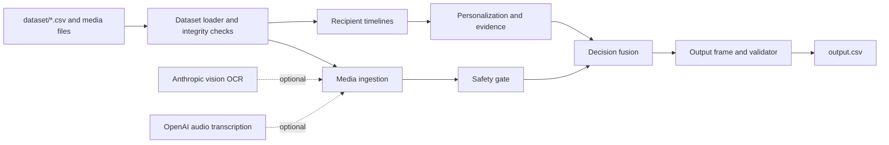

# Architecture

## Purpose and design goals

The Message Notification Router converts incoming WhatsApp messages into a complete, submission-ready routing table. Every incoming message receives one action:

- `notify` — interrupt the recipient now.
- `digest` — include the message in a later summary.
- `mute` — suppress a low-value, repetitive, unwanted, suspicious, or unsafe message.

The architecture is designed for four properties that matter in evaluation and operation:

1. **Complete coverage.** There is one validated decision for every incoming message.
2. **Safety before personalization.** A recipient's past behavior cannot elevate a message that crosses a safety threshold.
3. **Auditable outputs.** Reasons, confidence, and evidence identifiers are derived from explicit intermediate state rather than opaque model judgments.
4. **Degraded-mode operation.** Missing optional media credentials produce documented fallbacks instead of preventing a valid artifact from being produced.

## System topology



The dashed integrations normalize media into text; they do not select actions, types, reasons, confidence, or evidence. All routing policy is local and deterministic after normalization.

## Source layout

| Area | Responsibility |
| --- | --- |
| `code/main.py` | Command-line entry point; coordinates loading, routing, calibration, validation, writing, and console reporting. |
| `code/router/dataset/` | Participant-data schemas, loading, integrity checks, identifier validation, and chronological recipient timelines. |
| `code/router/ingestion/` | Text, image, and voice normalization; provider clients; path protection; and in-memory result caches. |
| `code/router/safety/` | User-independent risk signals, weighted scoring, verdicts, and immutable safety evidence. |
| `code/router/personalization/` | Recipient-scoped retrieval, historical evidence selection, and interaction, relationship, group, and quiet-hour signals. |
| `code/router/decision/` | Content signals, message-type classification, deterministic action fusion, confidence calculation, reason rendering, and decision trace state. |
| `code/router/output/` | Calibration, output-frame construction, submission validation, and UTF-8 CSV serialization. |
| `tests/` | Unit, contract, integration, regression, and end-to-end coverage for the routing pipeline. |

## Data boundaries and loading

The process begins with the participant-facing `dataset/` directory. The loader reads incoming messages together with users, groups, memberships, business accounts, user-business history, historical messages, message events, image metadata, voice-note metadata, and notification summaries.

The dataset layer is intentionally strict. It checks that required files and fields exist, validates relationships used by the router, and rejects malformed message identifiers and unsafe media references. In particular, media paths are confined to the dataset media tree instead of being trusted as arbitrary file-system paths. The loader does not consult organizer-only material or hidden labels.

Two collections are created from the same validated source:

- A production `DatasetBundle` for all incoming messages.
- A sample bundle used only to measure agreement against the supplied calibration sample.

Recipient timelines are derived from message history and events. They establish ordering and constrain evidence retrieval to information available to the recipient, preventing cross-recipient leakage.

## Processing pipeline

### 1. Media normalization

Text messages enter directly. Image and voice messages are normalized before downstream analysis:

- **Image messages** can be sent to a vision OCR adapter, which requests a structured response.
- **Voice notes** can be sent to an audio-transcription adapter, which requests verbose JSON.
- Results are cached by `media_id`. The production and calibration routes share the same cache during one execution, avoiding repeated external calls for the same attachment.

The normalization result records text, source information, and any failure state. A missing key, unavailable client, or provider failure does not crash routing: the remaining deterministic signals continue to run and the failure is exposed in the decision path. This makes a keyless local run reproducible while allowing richer media understanding when credentials are supplied.

### 2. User-independent safety gate

The safety gate receives a deliberately narrow `SafetyMessage` view: message identity, business identity, normalized content, forwarding count, and similar message-level facts. It does not receive recipient history, interaction rates, quiet hours, or personal preferences.

Rules identify signals such as suspicious payment or credential requests, unsafe or suspicious links, business verification and domain inconsistencies, impersonation cues, and high-forwarding spam characteristics. Signals contribute to deterministic scam and spam scores. Thresholds at or above `0.55` create blocking verdicts.

The gate produces immutable risk signals and a verdict. A blocked verdict forces `mute`; later components may explain it but cannot reverse it. Scores below threshold remain available to fusion as risk context, so borderline content can still be evaluated with its legitimate message-level and recipient-specific signals.

### 3. Recipient-scoped personalization and evidence

For messages that are not blocked, the personalization layer builds an evidence pool from the recipient's own timeline. Text similarity uses a receiver-scoped TF-IDF representation: it is fit only on the relevant recipient's historical content, not on a global corpus or another user's messages.

Candidate evidence must satisfy both identity and textual relevance constraints. The selector returns existing historical message IDs only, and returns no evidence rather than inventing an identifier. Complementary signals model:

- direct messages, group context, recipient role, muted groups, and direct mentions;
- business-account relationship and interaction history;
- open, reply, and dismiss behavior; and
- quiet-hour context.

The evidence layer feeds decision fusion, while the original incoming message remains the sole subject of the new decision.

### 4. Content understanding and deterministic fusion

The decision layer derives content urgency and chooses one of the permitted message types. It then combines content, safety, and personalization state in a stable precedence order:

1. A blocking safety verdict yields `mute`.
2. High-value or directly relevant content can yield `notify`.
3. Useful but non-immediate content can yield `digest`.
4. Low-value, unwanted, or otherwise suppressed content yields `mute`.

The actual fusion code centralizes thresholds and decision trace state so that output fields are mutually consistent. It creates a `DecisionRecord` with the final action, type, reason, confidence, and selected evidence. Reasons use concrete detected signals; they do not claim unsupported context.

Confidence is computed from explicit components: safety certainty, evidence availability, and agreement among signals. This avoids treating an external model's confidence as routing confidence and makes the numeric field inspectable and repeatable for the same inputs.

### 5. Artifact construction and validation

Decisions are converted into a pandas output frame with the exact submission-column order:

```text
message_id,action,message_type,reason,confidence,evidence_message_ids
```

The output validator checks all of the following before a file is written:

- exact required columns and order;
- one row for each incoming `message_id`, with no duplicate or missing identifiers;
- allowed action and message-type values;
- nonblank reasons and finite confidence values; and
- valid evidence serialization.

No-evidence decisions use `none`. Multiple evidence identifiers use semicolons (`;`), not commas, because commas are CSV field delimiters. The writer produces a readable UTF-8 CSV, and the validator protects the contract even when the output location is customized through the CLI.

## Runtime lifecycle

`python code/main.py` is the normal entry point. Its sequence is:

1. Parse `--dataset-dir` and `--output`, defaulting to `dataset/` and `dataset/output.csv`.
2. Build provider clients and shared media caches.
3. Load and validate the production bundle.
4. Route the production bundle through timeline, media, safety, personalization, and fusion.
5. Build and route the sample bundle with the same cache, then measure calibration.
6. Build, validate, and write the production output frame.
7. Print operational summaries and the final artifact path.

Expected data errors and ordinary file-system failures are handled at the command boundary with a clear nonzero exit rather than a partial artifact. Optional provider errors are handled at ingestion boundaries so one unavailable service does not suppress the entire batch.

## External-service boundary

The only external services are adapters for media-to-text conversion:

| Adapter | Environment variable | Role | Output used downstream |
| --- | --- | --- | --- |
| Anthropic vision | `ANTHROPIC_API_KEY` | OCR for image attachments | Normalized text and media status |
| OpenAI audio | `OPENAI_API_KEY` | Transcription for voice attachments | Normalized text and media status |

Provider clients are constructed once and wrapped by caches. Credentials are read from the environment only. Tests replace provider calls with fakes or mocks, so the test suite does not require network access or secrets. See [Design decisions and AI usage](DESIGN_DECISIONS_AND_AI_USAGE.md) for the policy and trade-offs behind this boundary.

## Determinism, observability, and reproducibility

The router keeps policy local: thresholding, retrieval, action selection, type assignment, evidence selection, confidence, reason text, and CSV serialization are deterministic. Given the same dataset and the same normalized media results, it produces the same artifact.

The CLI emits enough batch-level information to diagnose a run without printing credentials: counts for safety verdicts, media outcomes, personalization/evidence, final actions, calibration, and the written output path. Calibration compares the routed sample against the supplied sample labels without using those labels to choose production decisions.

The repository validates behavior with focused unit and contract tests, integration coverage across pipeline boundaries, regression cases, and end-to-end artifact checks. `interrogate -v code` enforces full docstring coverage for production modules.

## Operational constraints and extension points

The current policy is intentionally conservative. It prefers safety guarantees, grounded evidence, and inspectable heuristics over opaque model-based action selection. The design permits future adapters or scoring refinements if they preserve the same contracts:

- incoming messages must remain complete and identifier-safe;
- safety must remain isolated from recipient-specific preferences and retain non-overridable blocking behavior;
- evidence must remain recipient-scoped and refer to real historical message IDs;
- decisions must continue to serialize into the exact six-column artifact; and
- credentials and provider details must remain outside the repository.

For run instructions and artifact packaging, return to the [README](../README.md). For rationale, calibration, and the AI boundary, read [Design decisions and AI usage](DESIGN_DECISIONS_AND_AI_USAGE.md).

